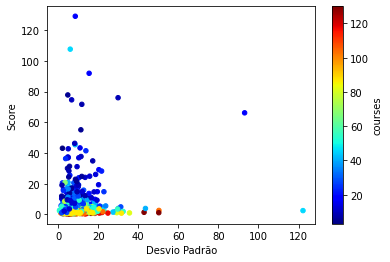
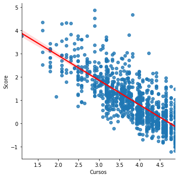

# Readme

## Características do problema
Nos foi apresentada a plataforma de ensino online, a Alura, com o objetivo de, após investigarmos a fundo o comportamento de seus usuários, sugerirmos soluções para, de forma orgânica, aumentar o engajamento/estudo dos inscritos com o site.
## Solução desenvolvida
Após análise e confecção de um modelo (que utilizava a quantidade de exercícios feitos, minutos de aula assistidos, quantidade de cursos inscritos e interações nos fóruns online), concluímos que, para aumentar o engajamento dos alunos, a Alura poderia criar mecanismos para sugerir descansos ao detectar "maratonas" de estudo, além de motivar os usuários a completarem os cursos nos quais estão inscritos, de modo a incentivar uma rotina de estudos mais constante, esta que, pelo que constatamos em nosso modelo, é a que apresenta maior rendimento de aprendizado na plataforma.
## Descrição dos dados
- Notebook "score_and_time_analysis.ipynb":
Contém a criação e implementação do modelo utilizado (batizado de score), assim como uma análise exploratória dos alunos com mais tempo de vídeo assistido na Alura, olhando como este grupo interage com os cursos em que se matriculam, completando-os ou não, em sua maioria.
- 
-
-

## Resultados
- Modelo:
O modelo criado, que leva em conta a quantidade de exercícios feitos, interações nos fóruns e cursos, além da quantidade de tempo de videoaula assistido (com todos os valores normalizados), foi essencial para nos fornecer as devidas vizualisações necessárias. Os resultados mais importantes foram os plots abaixo:

O desvio padrão, indicado no eixo das abcissas, tem valores maiores para ritmos de estudo mais esporádicos, com grandes picos de atividade e grandes períodos de inatividade, e valores menores para rotinas de estudo mais próximas de constancia. Conforme é possível enxergar, as maiores pontuações (Scores) estão associadas a rotinas de estudo constantes, com pouco desvio padrão.

Com ambos os eixos em escala logarítmica, pode-se notar com clareza que, conforme a quantidade de cursos (eixo X) aumenta, o engajamento (Score) diminui, com uma clara correlação entre as variáveis, indicada pela linha vermelha de regressão.
