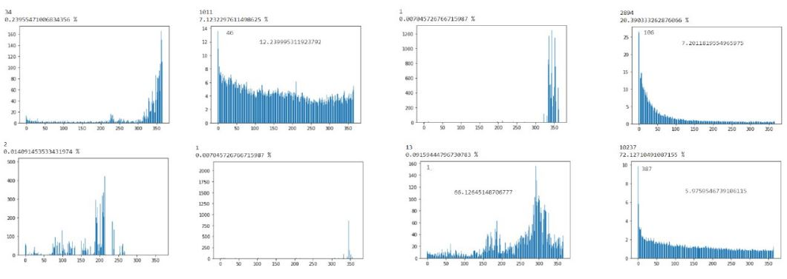
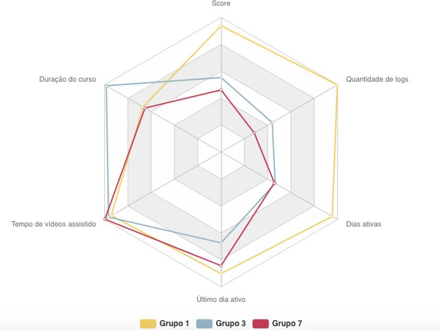

# Readme

## Características do problema
Nos foi apresentada a plataforma de ensino online, a Alura, com o objetivo de, após investigarmos a fundo o comportamento de seus usuários, sugerirmos soluções para, de forma orgânica, aumentar o engajamento/estudo dos inscritos com o site.
## Solução desenvolvida
Após análise e confecção de um modelo (que utilizava a quantidade de exercícios feitos, minutos de aula assistidos, quantidade de cursos inscritos e interações nos fóruns online), concluímos que, para aumentar o engajamento dos alunos, a Alura poderia criar mecanismos para sugerir descansos ao detectar "maratonas" de estudo, além de motivar os usuários a completarem os cursos nos quais estão inscritos, de modo a incentivar uma rotina de estudos mais constante, esta que, pelo que constatamos em nosso modelo, é a que apresenta maior rendimento de aprendizado na plataforma.
## Descrição dos dados
- Foram recebidas 7 arquivos no formato .csv com dados anonimizados de usuários e cursos da alura, esses arquivos são: _anonimized_courses.csv_, _anonimized_logs.csv_, _anonimized_registrations.csv_, _anonimized_section_harnessing_task.csv_, _anonimized_sections.csv_, _anonimized_tasks.csv_ e _anonimized_users.csv_ e estão detalhados no notebook inicial "EAD Alura.ipyb" e nos notebooks que os utilizaram.
- Pacotes python utilizados: pandas, matplotlib, seaborn
- Notebook "score_and_time_analysis.ipynb":
Contém a criação e implementação do modelo utilizado (batizado de score), assim como uma análise exploratória dos alunos com mais tempo de vídeo assistido na Alura, olhando como este grupo interage com os cursos em que se matriculam, completando-os ou não, em sua maioria.
- Notebook "completion_by_level":
Contém uma análise quantitativa da taxa de conclusão dos cursos comparados por nível de dificuldade
- Notebook "user_log_distribution.ipynb":
Neste notebook os dados são organizados de maneira a tornar visualizável a distribuição de atividades dos alunos ao longo dos dias.
- Notebook "user_log_clustering":
Neste notebook detalha-se a obtenção dos clusters dos usuários utilizando o algoritmo de K-means DTW. Utiliza-se aqui a biblioteca tslearn.
- Notebook "User_log_Profile":
Neste notebook detalha-se a obtenção dos clusters dos usuários utilizando o algoritmo de K-means com Transformada de Fourier discreta. Além disso, há EDA do arquivo _anonimized_logs.csv_  e relação dos clusters encontrados com o modelo do Notebook "score_and_time_analysis.ipynb".

## Coisas que foram tentadas mas não deram certo
- No início, tentamos representar a distruição da atividade do usuário através de apenas algumas dimensões como intervalo total de permanência, dias ativas de atividade e quantidade total de atividade. Logo notamos que esses features não são capazes de distinguir alguns personas que criamos, então tentamos colecionar quantidade de intervalos entre um dia ativo e outro. Os resultados também não foram satisfatórios nem para análise de correlação nem para clusterização com k-means.
- Utilizamos  PCA para redução de dimensionalidade com os features descritos acima para uma visualização 2D e 3D (eixo x e y com cores), no entando não encontramos nenhum padrão claro que distiguisse grupos visualmente.
- Depois que abandonamos os features acima, decidimos representar a distribuição de atividade de forma íntegra, computando quantidade de atividades por cada dia. Clusterização utilizando k-means diretamente não funcionou. A distância euclidiana ponto a ponto gerou clusters são padrão evidente.
- Quando decidimos experimentar a transformada de fourier, temos o problema de estabelecer uma métrica para ser utilizado por k-means, uma vez que após as transformadas, temos um vetor de números complexos. O que não funcionou foi decompor os valores complexos em módulo e fase, o que também não gerou clusters com padrão interpretável.
- Tentamos estudar o comportamento dos usuários pelo arquivo _anonimized_tasks.csv_, porém todas as entradas eram de usuários únicos, logo não havia como fazer nenhuma estatística direta sobre ele.

## Coisas que deram certo + resultados
- Modelo:
O modelo criado, que leva em conta a quantidade de exercícios feitos, interações nos fóruns e cursos, além da quantidade de tempo de videoaula assistido (com todos os valores normalizados), foi essencial para nos fornecer as devidas vizualisações necessárias. Os resultados mais importantes foram os plots abaixo:

O desvio padrão, indicado no eixo das abcissas, tem valores maiores para ritmos de estudo mais esporádicos, com grandes picos de atividade e grandes períodos de inatividade, e valores menores para rotinas de estudo mais próximas de constancia. Conforme é possível enxergar, as maiores pontuações (Scores) estão associadas a rotinas de estudo constantes, com pouco desvio padrão.

Com ambos os eixos em escala logarítmica, pode-se notar com clareza que, conforme a quantidade de cursos (eixo X) aumenta, o engajamento (Score) diminui, com uma clara correlação entre as variáveis, indicada pela linha vermelha de regressão.

- Clusterização com Dynamic Time Warping - K means:
Utilizando o método de Clusterização com Dynamic Time Warping, chegamos nos seguintes Clusters para os usuários:

Exemplos de alunos classificados como Cluster 5:

Exemplos de alunos classificados como cluster 3:

- Clusterização com Transformada de Fourier Discreta - K means:
Utilizando o método de Clusterização com Transformada de Fourier Discreta, chegamos nos seguintes Clusters para os usuários:

- Relacionamos o modelo criado com os clusters (achados com transformada de fourier discreta), e encontramos grupos com características distintas, representadas no polar chart abaixo:

## Licença & Direitos Autorais

© 2020 Liang Shen, Jônatas de Souza Nascimento, Gabriel Miranda de Araujo

Licença sobre a [Licença MIT](LICENSE)
